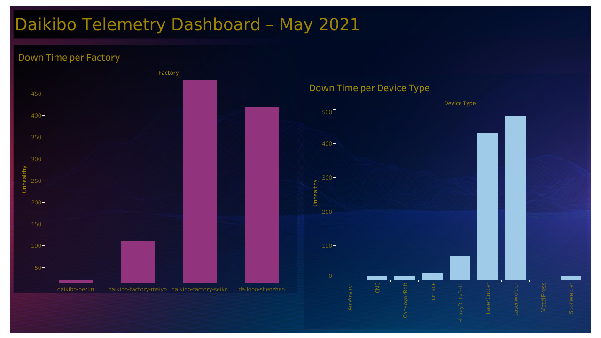
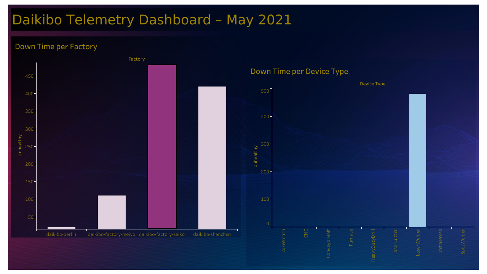

# 📊 Daikibo Telemetry Dashboard – May 2021

## 🚀 Overview

This dashboard provides an analysis of **machine downtime** across Daikibo factories and device types for the month of **May 2021**. It helps monitor operational health and pinpoint issues related to factory performance and equipment failures.

---

## 📁 Dataset

*Simulated Data*  
The dataset includes:
- Downtime counts by factory
- Downtime counts by device type  

---

## 📌 Key Insights

- 🏭 **Daikibo-Factory-Seiko** and **Daikibo-Shenzhen** reported the highest downtime.
- ⚙️ **Laser Welders** and **Laser Cutters** caused most of the equipment-related issues.
- 📉 Downtime is concentrated in specific factories and machinery, allowing for better-targeted maintenance strategies.

---

## 📊 Dashboard Features and Preview

### Version 1 

- **Left**: Downtime per Factory  
- **Right**: Downtime per Device Type (focused view)
- 🔧 Simple breakdown for high-level analysis

### Version 2 

- **Left**: Downtime per Factory  
- **Right**: Downtime per Device Type (detailed with more categories)
- 🧠 Enhanced insight into specific machines like:
  - **Laser Welder** (highest downtime)
  - **Laser Cutter**
  - Other devices such as Metal Press and Heavy Duty Drill show minimal issues

---

## 🧰 Tools Used

- Tableau Desktop
- Dummy dataset generated for simulation

---

## 🖼️ Preview

> Add your Tableau Public link here:
**[🔗 View Dashboard on Tableau Public](https://public.tableau.com/app/profile/nithya.reddy.banala/viz/DaikiboTelementaryDashboard-may2021/Dashboard1)**

---

## 💡 Use Cases

- Internal manufacturing performance review
- Predictive maintenance planning
- Factory floor issue diagnosis

---

## 📌 Note

This project was created for learning and visualization purposes using dummy data. It is not affiliated with any real company or official dataset.

---
